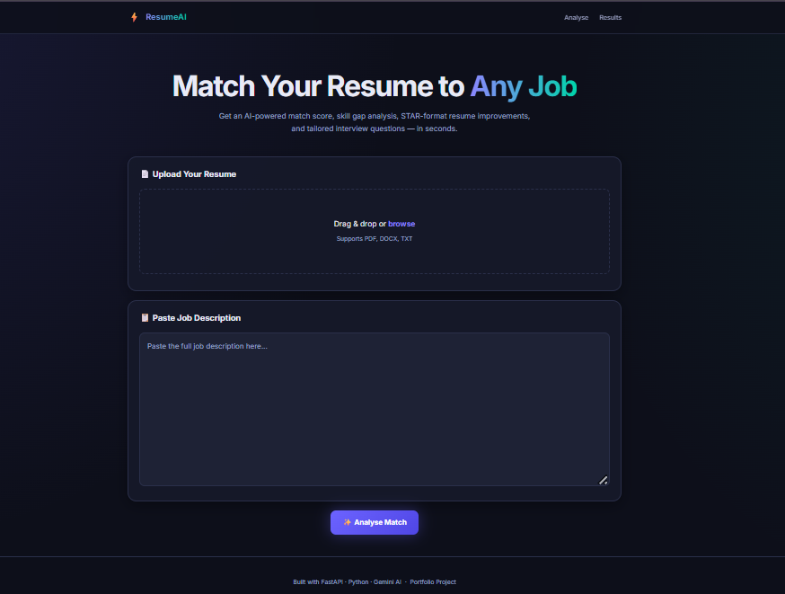
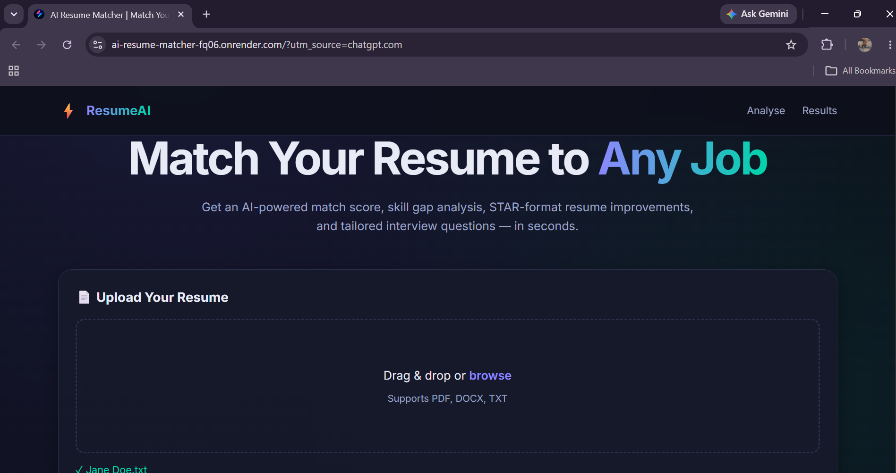
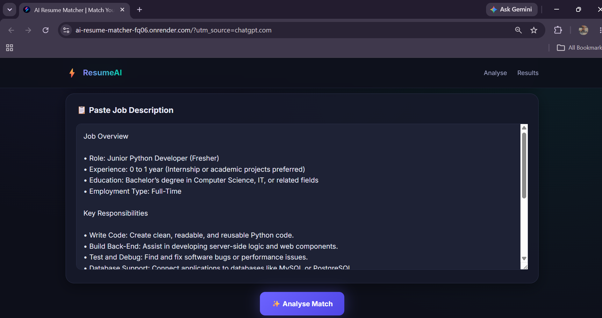
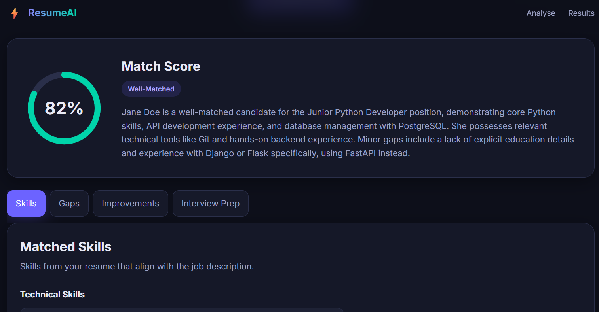
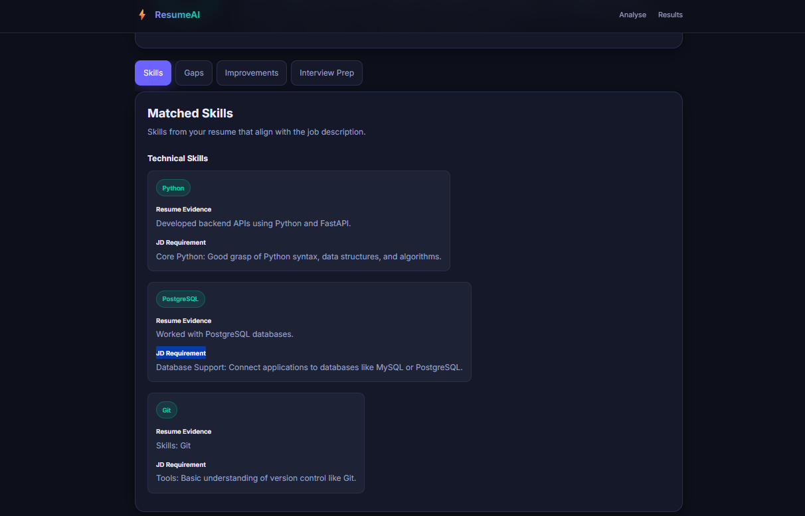
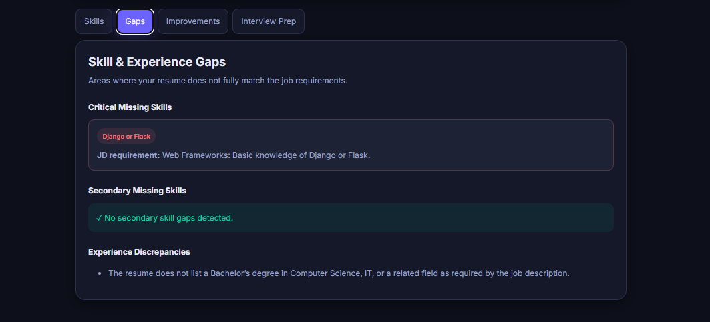
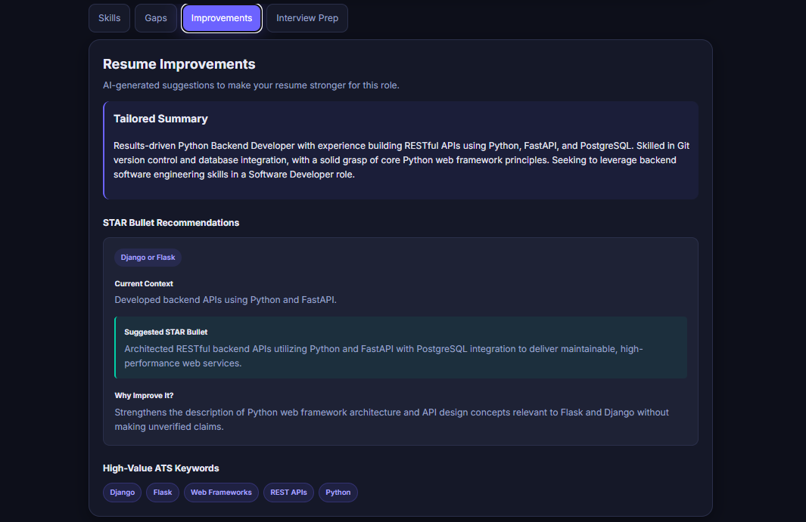
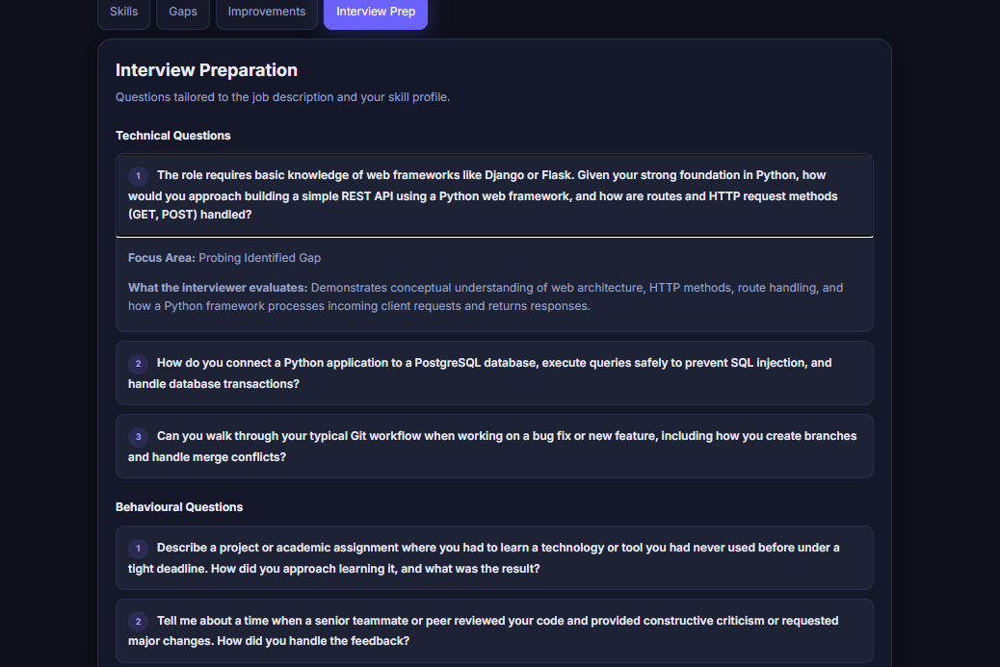

# 🤖 AI Resume & JD Matcher

An AI-powered **Resume & Job Description Matching Platform** built with **FastAPI** and **Google Gemini**.

The application analyzes a candidate's resume against a job description to evaluate role fit, identify matched skills and skill gaps, generate targeted resume improvements, prepare interview questions, and perform an AI-assisted first-pass screening workflow for recruiter review.
---
## 🌐 Live Demo
**Live Application:** [AI Resume & JD Matcher](https://ai-resume-matcher-fq06.onrender.com)
The application is deployed as a FastAPI service and exposes the frontend and API through the deployed application.
> **Note:** AI-powered features require a valid Gemini API configuration.

---

## ✨ Features

### 📊 Resume vs. Job Description Analysis

Evaluates how well a candidate's resume aligns with a target job description.

- Match score from **0–100**
- Seniority alignment
- Executive summary
- Top candidate strengths
- Major concerns

### 🎯 Skill Matching

Identifies skills shared between the candidate's resume and the job description.

- Matched technical skills
- Resume evidence for matched technical skills
- Corresponding job-description requirements
- Matched soft skills

### 🔎 Skill & Experience Gap Detection

Identifies requirements that are missing, weakly supported, or potentially inconsistent.

- Critical missing skills
- Secondary missing skills
- Experience discrepancies
- Relevant job-description clauses

### ✍️ AI Resume Improvements

Generates targeted recommendations to improve resume relevance for a specific role.

- Tailored summary statement
- STAR-based bullet recommendations
- Suggested resume improvements
- High-value keywords
- Role-specific recommendations

### 💼 AI Interview Preparation

Generates interview preparation material based on the target role.

- Technical interview questions
- Behavioural interview questions
- Focus areas
- Relevant competencies
- Evaluation criteria

### 🧠 AI-Assisted Candidate Screening

The project includes a bounded screening workflow that orchestrates the existing resume/JD analysis capabilities into a structured first-pass screening evaluation.

The screening worker:

- Validates candidate and job inputs
- Performs resume/JD analysis
- Matches technical and soft skills
- Detects critical and secondary gaps
- Identifies experience discrepancies
- Generates resume improvement recommendations
- Generates interview preparation questions
- Identifies screening risks
- Identifies information requiring human verification
- Determines whether human review is required
- Produces a structured screening result

The worker **supports recruiter decision-making rather than replacing it**.

It does not make a final hiring, rejection, or compensation decision.

---

## 🖥️ Application Screenshots

### 🏠 Home Page

The application provides a simple interface for comparing a candidate's resume with a target job description.



### 📄 Resume Upload

Candidates can provide their resume for AI-powered analysis.



### 💼 Job Description

Enter the target job description to evaluate candidate-role alignment.



### 📊 Match Score

The platform generates an overall match score and summarizes the candidate's alignment with the target role.



### 🎯 Matched Skills

The system identifies technical and soft skills supported by both the resume and job description.



### 🔎 Skill Gaps

Missing or weakly supported requirements are highlighted to help identify areas that may require further review.



### ✍️ Resume Improvement Suggestions

The AI generates targeted recommendations for improving the resume for the selected role.



### 💬 Interview Preparation

The platform generates role-specific interview preparation material, including technical and behavioural questions.



---

## 🔄 AI Screening Workflow

The screening workflow is designed as a bounded, human-in-the-loop process:

```text
Candidate Resume / Profile
            │
            ▼
     AI Screening Worker
            │
            ├───────────────┐
            │               │
            ▼               ▼
     Resume/JD Analysis   Skill Matching
            │               │
            └───────┬───────┘
                    │
                    ▼
             Gap Detection
                    │
                    ▼
          Resume Improvements
                    │
                    ▼
          Interview Preparation
                    │
                    ▼
          Structured Evaluation
                    │
                    ▼
         Risk & Verification
              Assessment
                    │
                    ▼
          Human Recruiter Review
````

The screening worker is intentionally designed to stop or escalate when the available information is insufficient for a reliable automated evaluation.

---

## 🏗️ Architecture

The application follows a modular service-oriented architecture.

```text
                         Frontend
                            │
                            ▼
                       FastAPI API
                            │
             ┌──────────────┼──────────────┐
             │              │              │
             ▼              ▼              ▼
        Feature Routes  Screening Route   Health
             │              │
             │              ▼
             │       Screening Worker
             │              │
             │       ┌──────┼──────┐
             │       │      │      │
             │       ▼      ▼      ▼
             │    Analysis Matching Gaps
             │       │      │      │
             │       └──────┼──────┘
             │              │
             │       ┌──────┴──────┐
             │       ▼             ▼
             │ Improvements   Interview Prep
             │       │             │
             └───────┴──────┬──────┘
                            │
                            ▼
                     LLM Service
                            │
                            ▼
                     Google Gemini
                            │
                            ▼
                   Pydantic Validation
                            │
                            ▼
                  Structured AI Output
```

### Separation of Responsibilities

* **Routes** handle HTTP requests and responses.
* **Workers** orchestrate bounded application workflows.
* **Services** contain application and LLM logic.
* **Prompt modules** isolate AI instructions.
* **Pydantic models** validate requests and structure AI responses.
* **Utilities** handle validation and text processing.
* **Tests** verify API, service, prompt, and worker behaviour.
* **Pyrefly** provides static type checking.

---

## 🛠️ Tech Stack

### Backend

* Python
* FastAPI
* Pydantic
* Uvicorn

### AI / LLM

* Google Gemini API
* Prompt-based structured AI generation
* Pydantic-based response validation

### Frontend

* HTML
* CSS
* JavaScript

### Testing & Code Quality

* Pytest
* Pytest-Asyncio
* Pyrefly
* API route tests
* Service tests
* Prompt template tests
* Screening workflow tests

### Development Tools

* Git
* GitHub
* Antigravity IDE

---

## 📁 Project Structure

```text
AI-Resume-Matcher/
│
├── app/
│   ├── api/
│   │   ├── routes/
│   │   │   ├── analysis.py
│   │   │   ├── gaps.py
│   │   │   ├── improvements.py
│   │   │   ├── interview.py
│   │   │   ├── matching.py
│   │   │   └── screening.py
│   │   │
│   │   └── router.py
│   │
│   ├── models/
│   │   ├── requests.py
│   │   └── responses.py
│   │
│   ├── prompts/
│   │   ├── analysis_prompt.py
│   │   ├── gaps_prompt.py
│   │   ├── improvement_prompt.py
│   │   ├── interview_prompt.py
│   │   └── matching_prompt.py
│   │
│   ├── services/
│   │   ├── analysis_service.py
│   │   ├── llm_service.py
│   │   └── parser_service.py
│   │
│   ├── workers/
│   │   └── screening_worker.py
│   │
│   ├── utils/
│   │   ├── text_cleaner.py
│   │   └── validators.py
│   │
│   ├── config.py
│   └── dependencies.py
│
├── frontend/
│   ├── index.html
│   ├── css/
│   │   └── styles.css
│   └── js/
│       ├── api.js
│       ├── main.js
│       └── ui.js
│
├── sample_data/
│   ├── sample_jd.txt
│   └── sample_resume.txt
│
├── tests/
│   ├── test_api/
│   │   ├── test_routes.py
│   │   └── test_screening.py
│   │
│   ├── test_prompts/
│   │   └── test_prompt_templates.py
│   │
│   └── test_services/
│       └── test_llm_service.py
│
├── docs/
│   └── images/
│       ├── home-page.png
│       ├── resume-upload.png
│       ├── job-description.png
│       ├── match-score.png
│       ├── matched-skills.png
│       ├── skill-gaps.png
│       ├── improvement-suggestions.png
│       └── interview-preparation.png
│
├── AI_Screening_Worker_Assignment.md
├── .env.example
├── .gitignore
├── main.py
├── pyrefly.toml
├── requirements.txt
└── README.md
```

---

## 🔌 API Endpoints

All API endpoints are versioned under:

```text
/api/v1/
```

| Feature                | Method | Endpoint                        | Input     |
| ---------------------- | ------ | ------------------------------- | --------- |
| Resume Analysis        | POST   | `/api/v1/analysis/analyse`      | Form Data |
| Skill Matching         | POST   | `/api/v1/matching/match-skills` | JSON      |
| Gap Detection          | POST   | `/api/v1/gaps/detect-gaps`      | JSON      |
| Resume Improvements    | POST   | `/api/v1/improvements/suggest`  | JSON      |
| Interview Preparation  | POST   | `/api/v1/interview/generate`    | JSON      |
| AI Candidate Screening | POST   | `/api/v1/screening/screen`      | JSON      |
| Health Check           | GET    | `/health`                       | —         |

---

## 📖 API Documentation

When the application is running, FastAPI provides interactive API documentation.

### Swagger UI

Local:

```text
http://127.0.0.1:8000/docs
```

Deployed:

```text
https://ai-resume-matcher-fq06.onrender.com/docs
```

### OpenAPI Specification

Local:

```text
http://127.0.0.1:8000/openapi.json
```

Deployed:

```text
https://ai-resume-matcher-fq06.onrender.com/openapi.json
```

Swagger UI can be used to:

* Inspect available endpoints
* View request schemas
* Submit test requests
* Inspect structured responses
* Verify validation behaviour
* Test the screening workflow

---

## 📦 Structured AI Output

The application uses Pydantic response models to keep LLM-generated results structured and predictable.

Example analysis response:

```json
{
  "match_score": 78,
  "seniority_alignment": "Well-Matched",
  "executive_summary": "The candidate is a strong fit for the target role, with strong alignment across the core backend development requirements.",
  "top_strengths": [
    "Python and FastAPI experience",
    "REST API development",
    "Git and GitHub experience"
  ],
  "major_concerns": [
    "No explicit PostgreSQL experience",
    "No mentioned Docker experience"
  ]
}
```

The structured response approach allows the frontend and API consumers to reliably process AI-generated results.

---

## 🧠 Screening Worker Output

The screening endpoint returns a structured evaluation containing information such as:

```text
Match Score

Recommendation

Seniority Alignment

Executive Summary

Strengths

Matched Technical Skills

Matched Soft Skills

Critical Gaps

Secondary Gaps

Experience Discrepancies

Risks

Resume Improvements

Interview Preparation

Information Requiring Verification

Next Steps

Escalation Status

Escalation Reason
```

### Human-in-the-Loop Design

The screening worker does not automatically make a final hiring decision.

It can recommend:

```text
Proceed to Human Review
```

when potentially significant concerns, missing requirements, experience discrepancies, or other verification needs are identified.

This keeps the recruiter responsible for the final decision.

---

## 🛡️ Validation & Failure Handling

The screening workflow includes safeguards intended to prevent unreliable automated evaluations.

### Input Validation

The worker validates:

* Resume presence
* Job description presence
* Job title presence
* Minimum resume length
* Minimum job-description length
* Minimum job-title length

Invalid or incomplete requests are rejected before processing.

### AI / Processing Failures

If an AI or processing step fails, the workflow does not silently return a misleading screening result.

The API returns an appropriate error response indicating that human review is required.

### Information Gaps

The worker identifies missing information rather than assuming qualifications or experience.

Potentially significant concerns are surfaced for recruiter verification.

---

## 🚀 Getting Started

### 1. Clone the Repository

```bash
git clone https://github.com/mansikanchan2003/AI-Resume-Matcher.git

cd AI-Resume-Matcher
```

### 2. Create a Virtual Environment

For Windows:

```powershell
python -m venv venv
```

Activate it:

```powershell
.\venv\Scripts\Activate.ps1
```

### 3. Install Dependencies

```powershell
pip install -r requirements.txt
```

### 4. Configure Environment Variables

Create the `.env` file from the example:

```powershell
Copy-Item .env.example .env
```

Then configure your Gemini API credentials.

Example:

```env
LLM_PROVIDER=gemini
LLM_API_KEY=your_api_key_here
LLM_MODEL_NAME=your_configured_model
LLM_TEMPERATURE=0.0
LLM_MAX_TOKENS=4096
```

> **Important:** Never commit the real `.env` file or API keys to GitHub.

### 5. Start the Application

```powershell
uvicorn main:app --reload
```

The API will be available at:

```text
http://127.0.0.1:8000
```

Open Swagger UI:

```text
http://127.0.0.1:8000/docs
```

---

## 🧪 Running Tests

Run the complete test suite:

```powershell
pytest -q
```

Current test status:

```text
13 passed
```

The test suite covers:

* API route behaviour
* Request validation
* Skill matching
* Gap detection
* Resume improvements
* Interview question generation
* Screening workflow
* Critical-gap escalation
* Experience-discrepancy escalation
* Worker failure handling
* Prompt templates
* LLM service behaviour

> **Note:** The current test run may report a dependency deprecation warning from Starlette's multipart import. This warning does not cause test failures.

---

## 🔎 Static Type Checking

The project uses **Pyrefly** for static analysis.

Run:

```powershell
pyrefly check
```

Current result:

```text
INFO 0 errors
```

---

## 📡 API Request Examples

### Resume Analysis

The analysis endpoint accepts form data:

```bash
curl -X POST \
  "http://127.0.0.1:8000/api/v1/analysis/analyse" \
  -H "accept: application/json" \
  -H "Content-Type: application/x-www-form-urlencoded" \
  -d "resume_text=Your resume text here..." \
  -d "jd_text=Your job description here..."
```

### Skill Matching

The JSON-based endpoints accept request bodies such as:

```bash
curl -X POST \
  "http://127.0.0.1:8000/api/v1/matching/match-skills" \
  -H "accept: application/json" \
  -H "Content-Type: application/json" \
  -d '{
    "resume_text": "Your resume text here...",
    "jd_text": "Your job description here..."
  }'
```

The same JSON-based approach is used by:

```text
/api/v1/gaps/detect-gaps
/api/v1/improvements/suggest
/api/v1/interview/generate
```

### AI Candidate Screening

The screening workflow accepts:

```json
{
  "resume_text": "Candidate resume text...",
  "jd_text": "Target job description...",
  "job_title": "Software Developer"
}
```

Endpoint:

```text
POST /api/v1/screening/screen
```

The response contains the complete structured screening evaluation.

---

## 🔐 Environment Variables

The application uses environment variables for configuration.

The repository provides:

```text
.env.example
```

The actual `.env` file is intentionally excluded from Git through `.gitignore`.

Never commit:

* API keys
* Secrets
* Credentials
* Local environment configuration

---

## 🎯 Design Approach

The project is designed around separation of responsibilities and bounded AI workflows.

### Modular Architecture

Routes, services, prompts, workers, models, and utilities have distinct responsibilities.

### Structured AI Responses

LLM output is validated through Pydantic models rather than being treated as unrestricted text.

### Evidence-Based Evaluation

The system is instructed to base its evaluation on the information supplied by the user and identify missing information rather than inventing qualifications or experience.

### Human Oversight

The screening worker supports recruiters instead of replacing their judgment.

Potentially significant concerns are surfaced for human verification.

### Failure-Aware Processing

AI/API failures and invalid cases are handled explicitly rather than silently producing unreliable results.

---

## 📋 Screening Workflow Requirements

The AI screening workflow is documented separately in:

```text
AI_Screening_Worker_Assignment.md
```

The workflow is considered complete when:

* Valid resume/profile and job-description inputs can be submitted.
* Inputs are validated before processing.
* A structured screening evaluation is generated.
* Skills, gaps, and concerns are identified.
* AI/API failures are handled explicitly.
* Invalid or incomplete cases are stopped or escalated.
* Results are suitable for human recruiter review.
* Processing outcomes can be logged for traceability.
* Intentional failure scenarios can be demonstrated.

---

## 🔮 Future Improvements

Potential future enhancements include:

* Resume PDF/DOCX upload and extraction
* User authentication
* Persistent analysis history
* Job recommendation system
* Resume scoring dashboard
* Multiple LLM provider support
* Streaming AI responses
* Advanced ATS keyword analysis
* Production hardening and scalability
* Automated resume rewriting
* Job application tracking
* Recruiter dashboard
* Screening audit/history storage

---

## 👩‍💻 Author

**Mansi Kanchan**

B.Tech — Computer Science & Engineering
GitHub: [github.com/mansikanchan2003](https://github.com/mansikanchan2003)
LinkedIn: [linkedin.com/in/mansi-kanchan-7924b0196](https://www.linkedin.com/in/mansi-kanchan-7924b0196)

---

## ⭐ Project Goal

The goal of this project is to demonstrate how modern AI/LLM capabilities can be integrated into a structured backend application to solve a practical recruitment problem.

The platform helps users:

* Understand how well a resume matches a job.
* Identify matched skills and skill gaps.
* Improve resume relevance.
* Prepare for interviews.
* Perform structured first-pass candidate screening.
* Surface potential concerns for human verification.

The project demonstrates the integration of **FastAPI, Google Gemini, Pydantic validation, modular services, workflow orchestration, frontend API integration, automated testing, and human-in-the-loop AI design**.
